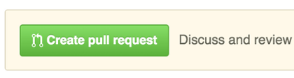

# Contributing to the FTC SDK

The following is a set of guidelines for contributing the FIRST FTC SDK.  The FTC Technology Team welcomes suggestions for improvements to core software, ideas for new features, requests for built-in support of new sensors, and well written bug reports.

## How can I contribute?

### Pull requests

__STOP!__  If you are new to git, do not understand the mechanics of forks, branches, and pulls, if what you just read is confusing, __do not__ push this button.  Most likely it won't do what you think it will.

If you are looking at this button then you've pushed some changes to your team's fork of ftctechnh/ftc_app.  Congratulations!  You are almost certainly finished.

The vast majority of pull requests seen on the ftctechnh/ftc_app repository are not intended to be merged into the official SDK.  Team software is just that, your team's.  It's specific to the tasks you are trying to accomplish, the testing you are doing, and goals your team has.  You don't want that pushed into the official SDK.

If what you've read so far makes little sense, there are some very good git learning resources online.  
[Git Book](https://git-scm.com/book/en/v2)  
[Interactive Git Tutorial](https://try.github.io)

### Guidlines for experienced GIT users.

If you are absolutely certain that you want to push the big green button above, read on.  Otherwise back _slowly away from keyboard_.

The real intent for advanced users is often to issue a pull request from the [branch](https://www.atlassian.com/git/tutorials/using-branches/git-branch) on a local fork back to master on either the same local fork or a child of the team fork and not on the parent ftctechnh/ftc_app.  See [Creating a Pull Request](https://help.github.com/articles/creating-a-pull-request-from-a-fork/).

If that is indeed the intent, then you can merge your [topic branch](https://git-scm.com/book/en/v2/Git-Branching-Branching-Workflows#Topic-Branches) into master locally by hand before pushing it up to github, or if you want a pull request for pulls between branches on the same repository because, say, you want team members to look at your software before merging into master, you can select the base fork from the dropdown on the "Open a pull request" page and select your team repo instead of ftctechnh's.

Alternatively, if you have a team repository forked from ftctechnh/ftc_app, and then team members individually fork from your team repository, then pull requests from the individual team member's forks will have the main team repository automatically selected as the base fork for the pull. And you won't inadvertently request to pull your team software into ftctechnh's repository.

The latter would be the "best" way to manage software among a large team. But as with all things git there are many options.

Pull requests that do not fall into the category above are evaluated by the FTC Technology Team on a case-by-case basis.  Please note however that the deployment model of the SDK does not support direct pulls into ftctechnh/ftc_app.  

### Report bugs

This section guides you through filing a bug report.  The better the report the more likely it is to be root caused and fixed.  Please refrain from feature requests or software enhancements when opening new issues.  See Suggesting Enhancements below.

#### Before submitting a bug report

- Check the [forums](http://ftcforum.firstinspires.org/forum.php) to see if someone else has run into the problem and whether there is an official solution that doesn't require a new SDK.

- Perform a search of current [issues](https://github.com/FIRST-Tech-Challenge/FtcRobotController/issues) to see if the problem has already been reported.  If so, add a comment to the existing issue instead of creating a new one.

#### How Do I Submit A (Good) Bug Report?

Bugs are tracked as GitHub issues. Create an issue on ftctechnh/ftc_app and provide the following information.
Explain the problem and include additional details to help maintainers reproduce the problem:

- Use a clear and descriptive title for the issue to identify the problem.

- Describe the exact steps which reproduce the problem in as many details as possible.

- Provide specific examples to demonstrate the steps.

- Describe the behavior you observed after following the steps and point out what exactly is the problem with that behavior. Explain which behavior you expected to see instead and why. If applicable, include screenshots which show you following the described steps and clearly demonstrate the problem.

- If you're reporting that the RobotController crashed, include the logfile with a stack trace of the crash.  [Example of good bug report with stack trace](https://github.com/ftctechnh/ftc_app/issues/224)

- If the problem wasn't triggered by a specific action, describe what you were doing before the problem happened and share more information using the guidelines below.

### Suggesting Enhancements

FIRST volunteers are awesome.  You all have great ideas and we want to hear them.  

Enhancements should be broadly applicable to a large majority of teams, should not force teams to change their workflow, and should provide real value to the mission of FIRST as it relates to engaging youth in engineering activities.

The best way to get momentum behind new features is to post a description of your idea in the discussions section of this repository.  Build community support for it.  The FTC Technology Team monitors the discussions.  We'll hear you and if there's a large enough call for the feature it's very likely to get put on the list for a future release.
